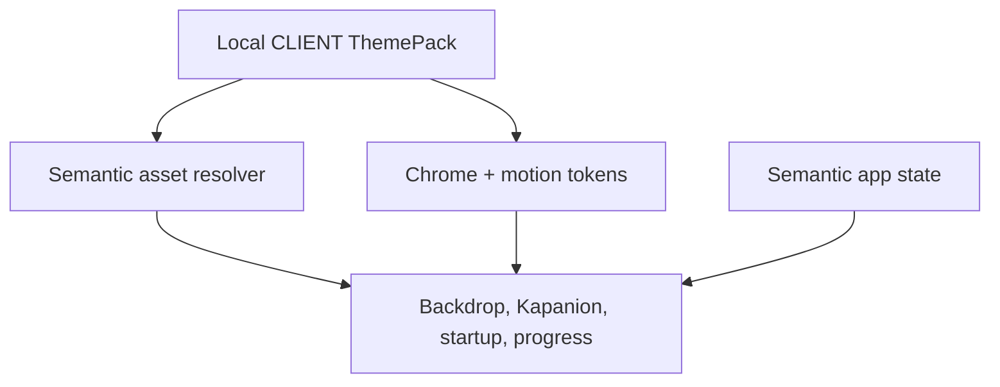
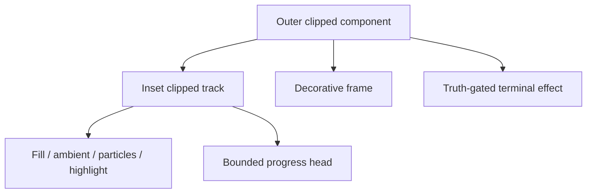

# CLIENT Theme Chrome Runtime v1

Checkpoint: `INT-THEME-035C`
Extends: `ADR-0025 — Declarative ThemePack Engine`

## Boundary

The runtime converts one selected declarative `ThemePack` into CLIENT presentation. It does not own application truth.

`Semantic app state` remains authoritative for mission progress, readiness, permissions, trust, connection, Forge, and terminal outcomes. Theme renderers decide only how those states look.

## Chrome contract

`ThemeChromeStyle` adds:

- `motif`: procedural ornament family;
- `backgroundArtRole`: semantic background identity;
- `kapanionRole`: header/chat/companion identity;
- `voiceCoreRole`: tap-to-speak identity;
- bounded background and ornament alpha;
- bounded edge complexity and ambient tilt.

All fields have safe manifest-v1 defaults, so older declarative packs remain readable. Validation rejects unsupported semantic roles and out-of-range visual values.

## Rendering

`ThemeAppBackdrop` resolves selected background art once through Android resources, animates transform/alpha only, places a dark readability veil above it, and adds a lightweight motif canvas.

`ThemeKapanionAvatar` is reused at multiple sizes while retaining one semantic identity. Decorative instances are excluded from accessibility; the header instance has a concise description.

`ThemeChromePanel` and `ThemeChromeBox` preserve layout semantics and touch behavior while applying pack-defined corner geometry, gradient edges, and low-alpha corner ornaments.

## Progress layout

Every moving layer uses the same start/end/vertical inset. The head’s travel distance is `trackWidth - headWidth`. An indeterminate segment moves only inside the track. The outer component clips all artwork as a final containment boundary.

## Startup layout

Jester is the only full ignition pack. Its core-state artwork crossfades in narrow windows, while effect artwork uses separate bounded sizes and transforms. Other themes use their own Kapanion/emblem with a short reveal. The startup overlay never fabricates readiness or blocks initialization.

## Performance and accessibility

- Existing preprocessed PNG/WebP resources are reused.
- Launcher masters and screen backgrounds remain separate; Glitch Dragon Glass uses a bounded 720×1280 runtime WebP background.
- No per-frame bitmap allocation or regeneration is introduced.
- Motion uses transforms, alpha, clipping, and canvas primitives.
- Android animator state and the CLIENT motion setting remain authoritative.
- Reduced motion removes ongoing drift/pulse and uses static startup presentation.
- Decorative artwork has no semantic status role.
- Status remains readable in text and retains locked semantic colors.

## Extension rule

A future built-in theme adds assets, semantic mappings, chrome tokens, and registration. It does not require CLIENT screen rewrites. A future custom pack remains declarative and must pass the existing archive/manifest validator before activation.
