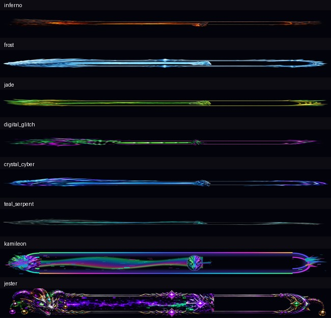

# INT-THEME-035C — CLIENT Theme Chrome + Runtime Visual Repair

Status: `SOURCE IMPLEMENTED; REPOSITORY PACKAGE-PAIR VERIFICATION FAILED; SUPERSEDED BY INT-THEME-035D`
Date: 2026-07-26
Target: CLIENT only
Source identity: `CLIENT CFv2.1.8`
Android identity: versionCode `106`, versionName `2.1.8-theme-chrome-runtime-repair-v1`

## Parent lineage

- Canonical repository: `kamiswrlzco-cloud/Swrlzco`
- Parent package: `swrlz-core/sources/client/CLIENT_CFv2.1.7_SWRLZ.zip`
- Parent SHA-256: `bc5b941e9b0c86e28581d8f6019b6c54722243279ef666aa3c35c4f97745fe76`
- Parent checkpoint: `INT-THEME-035B`
- Parent archive and checksum were verified before extraction.
- The unchanged parent package remains the rollback baseline.

## Reported defects and confirmed causes

| Reported behavior | Confirmed source cause | Repair |
|---|---|---|
| Base theme showed the old launcher icon | The default launcher alias and application icon still resolved to the legacy `ic_launcher_adaptive_foreground` family | Replaced Glitch Dragon launcher density assets, added a new transparent adaptive foreground derived from the approved Glitch Dragon Glass master, and pointed application/adaptive identity at the repaired resource |
| Startup showed an empty circle | Default and legacy ThemePacks declared no Kapanion/startup identity, so the fallback exhausted its roles and rendered a generic circle | Declared distinct identity/background roles for every selectable CLIENT theme; fallback startup now always resolves a theme-owned Kapanion or emblem |
| Preview progress effects crossed the screen and misaligned | Fill, head, highlight, and particles used the full composable width; the declared track inset was not applied; moving layers were not clipped to one shared track | Added calibrated start/end/vertical track geometry and clipped every moving layer before drawing the outer frame |
| Jester startup layers spawned over one another | Eight artwork layers shared `fillMaxSize()` with broad overlapping alpha windows | Replaced broad stacking with staged core-state crossfades and separately sized/scaled/rotated spark, radial, particle, shockwave, and residual effects |
| Selected themes changed color but not the whole interface | The CLIENT shell hard-coded `glitch_dragon_core` for its backdrop, voice orb, companion rail, and header symbol | Added reusable ThemePack chrome and applied selected background art, Kapanion, motif field, border ornaments, panel geometry, and motion personality across the shell |

## Implemented presentation behavior

- Every selectable theme declares a `ThemeChromeStyle` with a distinct motif:
  - Glitch Dragon Glass — glass shard
  - Dragon Kamileon — prismatic
  - Original Core — core circuit
  - Glitch Neon — neon scan
  - Pharaoh Emerald — pharaoh glyph
  - Void Jester — void jester
  - Inferno — magma
  - Frost — frost
  - Jade — jade vine
  - Digital Glitch — digital glitch
  - Crystal Cyber — cyber crystal
  - Teal Serpent — teal serpent
  - Jester Glitch Dragon — jester chaos
- Existing theme-specific art remains distinct. Jester art is not reused as a universal identity.
- The active Kapanion now appears in the CLIENT header, tap-to-speak core, companion rail, assistant chat messages, and live theme preview.
- Main panels and quick actions use the active pack’s shape, gradient border, corner ornament, palette, and motion tokens.
- Background atmosphere resolves from the selected pack and uses lightweight transform/alpha/canvas animation rather than frame-by-frame bitmap generation.
- The 1536×1536 Glitch Dragon launcher master is not decoded as a screen background; a derived 720×1280 WebP is used for that role.
- The runtime catalog now verifies 103 theme assets: the prior 101 plus the derived Glitch Dragon background and a Teal CLIENT launcher derived from Teal’s own emblem.
- CLIENT bubble/shortcut identity uses the selected Kapanion for the new asset-backed themes.
- Theme selection remains local and presentation-only.

## Progress truth and geometry

- Known values continue to drive determinate fill.
- Unknown values remain indeterminate and do not fabricate percentage.
- Paused state stops decorative motion.
- Completion/failure/interruption/cancellation effects still require their real semantic state.
- Fill, ambient energy, particles, highlight, and progress head share one clipped inner track.
- Start, end, and vertical insets are pack-calibrated.
- The decorative frame is drawn after the clipped track; the head is then drawn inside the same track bounds.
- TalkBack receives the operation label, status text, and determinate/indeterminate range semantics.

## Startup behavior

- Jester Core Ignition retains the same readiness-concurrent startup host and approximately 0.6–1.2 second normal target.
- Core states are legible sequentially: dormant → spark → partial → awakened.
- Shockwave, radial, particles, and residual glow are effect layers with narrower timing windows and bounded sizes.
- Other themes use their own static/animated Kapanion fallback; missing Jester-like artwork is not invented.
- Reduced motion renders a static theme identity and a short fade.
- Long initialization transitions to truthful indeterminate progress.

## Files changed

- `android/theme-contract/src/main/kotlin/sh/swrlz/theme/ThemeManifest.kt`
- `android/theme-contract/src/main/kotlin/sh/swrlz/theme/ThemeValidator.kt`
- `android/theme-contract/src/main/kotlin/sh/swrlz/theme/BuiltInThemePacks.kt`
- `android/theme-contract/src/test/kotlin/sh/swrlz/theme/ThemeContractTest.kt`
- `android/app/src/main/java/sh/swurlz/core/ui/theme/ThemeChrome.kt`
- `android/app/src/main/java/sh/swurlz/core/ui/theme/ThemePackRuntime.kt`
- `android/app/src/main/java/sh/swurlz/core/ui/theme/ThemedProgress.kt`
- `android/app/src/main/java/sh/swurlz/core/ui/theme/ThemeStartupHost.kt`
- `android/app/src/main/java/sh/swurlz/core/ui/client/ClientShellScreen.kt`
- `android/app/src/main/java/sh/swurlz/core/ui/screens/StyleScreen.kt`
- `android/app/src/main/java/sh/swurlz/core/identity/ThemeIdentityManager.kt`
- `android/app/src/main/AndroidManifest.xml`
- Glitch Dragon launcher/adaptive resources under `android/app/src/main/res/`
- `android/app/src/main/assets/themes/runtime_asset_catalog.json`
- `tools/theme_assets/derive_client_theme_chrome.py`
- `tools/theme_assets/README.md`
- `android/app/build.gradle.kts`
- Theme manifest example and checkpoint/architecture/release/engineering documentation

## Preserved boundaries

No protocol model, connection behavior, trust rule, Truth Firewall rule, identity proof, permission, mission authority, Forge transaction authority, accessibility automation behavior, notification authority, local/remote distinction, or offline-first behavior was changed.

No SERVER source was modified.

## Verification boundary

Source-only verification for this checkpoint covers:

- parent ZIP/checksum pairing and archive integrity;
- intended changed-file scope;
- XML/JSON parsing;
- manifest semantic-role and Android resource existence;
- launcher density/alpha/dimension checks;
- byte-identical repeat generation of CLIENT Glitch Dragon and Teal launcher derivatives;
- built-in theme chrome/fallback completeness;
- Kotlin lexical/delimiter checks;
- archive path safety and final ZIP integrity;
- immutable source ZIP/SHA-256/manifest pairing.

Pre-package source verification result: `PASS`

- 45-file bounded parent diff;
- 34 Android XML documents parsed;
- 3 JSON contracts/catalogs parsed;
- 11 changed Kotlin files passed lexical/delimiter checks;
- 13 launcher aliases matched their identity registry entries;
- 103 runtime catalog entries matched file bytes, dimensions, and SHA-256;
- 12 repaired/default launcher images passed size/alpha checks.

Static progress geometry evidence:

This composite verifies asset scaling, shared track inset, mask, head placement, and frame containment. It is not Android runtime or device evidence.

Not run or claimed at source packaging time:

- Gradle or Kotlin/Android compilation;
- unit, instrumentation, or UI tests;
- APK/AAB assembly or signing;
- Android launcher-cache/device behavior;
- startup choreography/frame-time/memory acceptance;
- phone/tablet/font-scale/TalkBack/reduced-motion device acceptance;
- release, deployment, or installation.

## Repository and CI evidence

- PR #1 merged to `main` at `bc80d7a4d28d656f640ac1a511b9ae340e8b45ee`.
- Source Package Integrity run `30222384992` selected the correct CFv2.1.8 ZIP
  and failed because its manifest lacked canonical `zip`, `size_bytes`, and
  `verified: true` fields.
- APK Router run `30222384996` passed resolver tests, selected the correct
  CFv2.1.8 ZIP/SHA pair, and failed at the same package-verification step.
- Kotlin/Android compilation was skipped and no APK artifact was produced.
- The failure is packaging lineage, not evidence of an application compile defect.

## Current disposition

The failed CFv2.1.8 pair remains immutable lineage. CLIENT CFv2.1.9 under
INT-THEME-035D preserves the theme implementation and repairs package/application
identity plus the canonical manifest contract.

No release, deployment, installation, SERVER, protocol, or authority change is
claimed by this historical checkpoint.
